# ChessAnalyst

ChessAnalyst es una aplicación de análisis de partidas de ajedrez que permite a los usuarios cargar partidas desde Lichess.org o archivos PGN, analizar jugadas con el motor Stockfish, practicar ejercicios tácticos y visualizar estadísticas de aperturas y resultados. Incluye autenticación de usuarios y recursos de aprendizaje.

## Características principales
- Autenticación de usuarios (registro e inicio de sesión)
- Carga de partidas desde Lichess.org o archivos PGN
- Análisis de partidas con Stockfish
- Visualización de estadísticas de aperturas y resultados
- Ejercicios tácticos personalizados y modo de práctica libre
- Recursos de aprendizaje de ajedrez

## Estructura del proyecto
```
ChessAnalyst-master/
├── ChessAnalyst imagenes/         # Imágenes para la documentación y la app
├── OneDrive/Documentos/NetBeansProjects/ChessAnalysisApp1/
│   ├── src/
│   │   ├── Model/                 # Lógica de negocio y conexión con servicios externos
│   │   ├── ModelView/             # Controladores y modelos de vista
│   │   ├── View/                  # Vistas gráficas (Swing)
│   │   ├── chessapp/              # Main y formularios principales
│   │   └── resources/             # Recursos: imágenes, stockfish, eco.pgn, etc.
│   ├── lib/                       # Librerías externas (JARs)
│   ├── build.xml                  # Script de construcción (NetBeans/Ant)
│   └── manifest.mf                # Manifest del proyecto
└── README.md
```

## Instalación y ejecución
1. **Requisitos previos:**
   - Java 8 o superior
   - NetBeans (recomendado) o cualquier IDE compatible con proyectos Ant
   - Conexión a internet para uso de Firebase y Lichess

2. **Clonar o descomprimir el proyecto:**
   - Si tienes el ZIP, descomprímelo y ubica la carpeta `ChessAnalyst-master`.

3. **Abrir el proyecto en NetBeans:**
   - Ve a `File > Open Project` y selecciona la carpeta `ChessAnalysisApp1`.

4. **Agregar librerías externas:**
   - Asegúrate de que la carpeta `lib/` esté incluida en el classpath del proyecto.

5. **Compilar y ejecutar:**
   - Usa el botón de "Run" en NetBeans o ejecuta el proyecto con Ant: `ant run`

## Configuración necesaria
### 1. Ruta de Stockfish
- Modifica la ruta del ejecutable `stockfish-windows-x86-64.exe` en:
  - `src/Model/Stockfish.java` (línea 22)
  - `src/Model/GameAnalysis.java` (línea 47)
  - Usa la ruta relativa: `src/resources/stockfish/stockfish-windows-x86-64.exe`

### 2. Configuración de Firebase
- Descarga el token JSON de tu proyecto Firebase y colócalo en una ruta accesible.
- Modifica las rutas en `src/Model/FirebaseServices.java` (líneas 37, 46 y 47) para:
  - Ruta del token JSON
  - URL de la base de datos
  - Ruta relativa recomendada: `src/resources/firebase-token.json`

### 3. Token de Lichess
- Crea un token en https://lichess.org/account/oauth/token
- Modifica el valor en `src/Model/LichessAPI.java` (línea correspondiente)

### 4. Archivo de aperturas eco.pgn
- Asegúrate de que `src/resources/eco.pgn` esté presente.
- Modifica la ruta en `src/Model/OpeningHistogram.java` (línea 31) a la ruta relativa.

## Dependencias
- Todas las dependencias JAR necesarias están en la carpeta `lib/`:
  - chesslib.jar, gson-2.11.0.jar, firebase-admin-9.4.3.jar, jfreechart-1.5.3.jar, etc.
- No es necesario descargar dependencias externas si usas la estructura incluida.

## Manual de Usuario
### Autenticación
El usuario debe registrarse o iniciar sesión al abrir la aplicación.

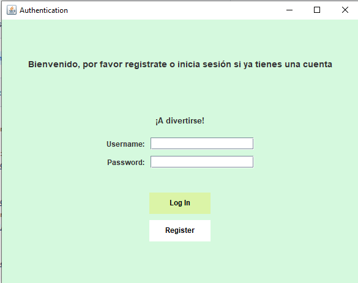

### Menú principal
Permite cargar partidas, practicar ejercicios o acceder a recursos de aprendizaje.

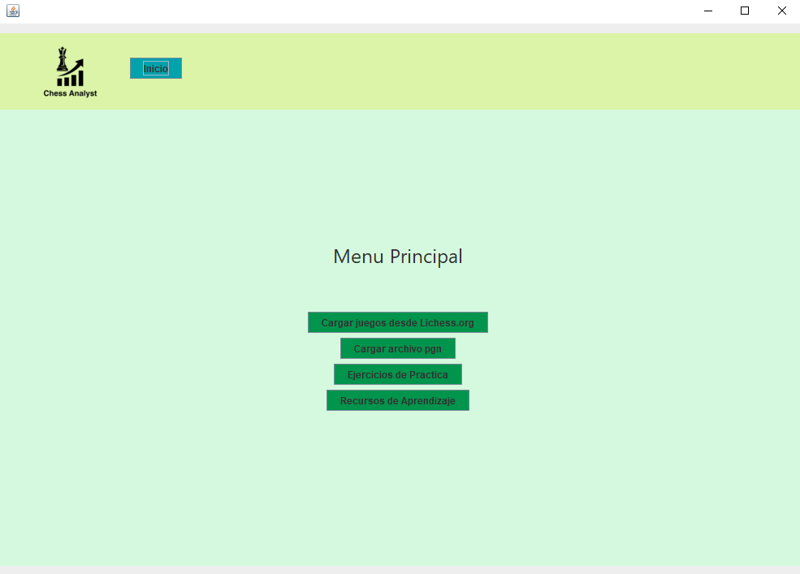

### Cargar partidas desde Lichess.org
Ingresa tu usuario de Lichess y carga tus partidas.

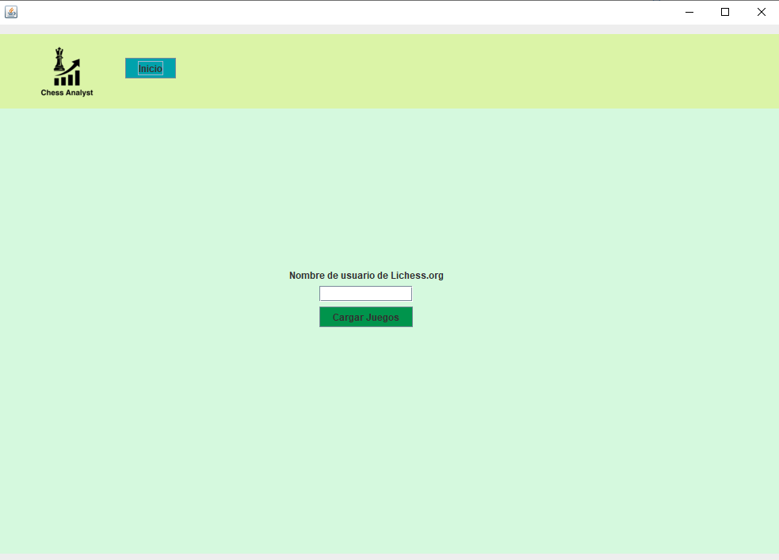

### Cargar partidas desde archivo PGN
Selecciona un archivo PGN local para analizar.

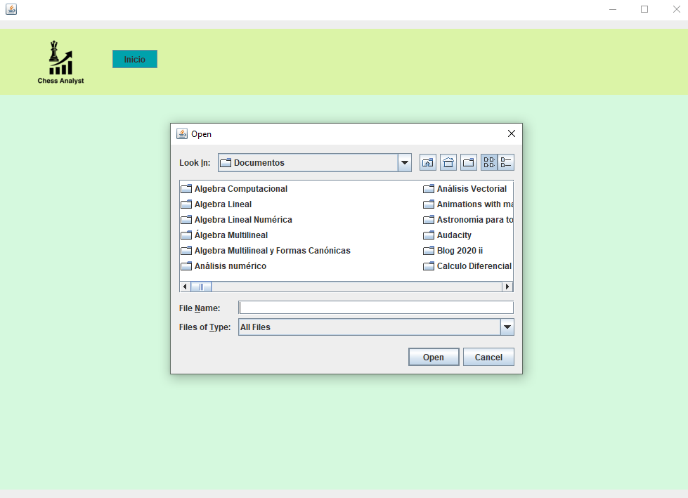

### Estadísticas y análisis
Visualiza estadísticas de aperturas y resultados, y analiza partidas jugada por jugada.

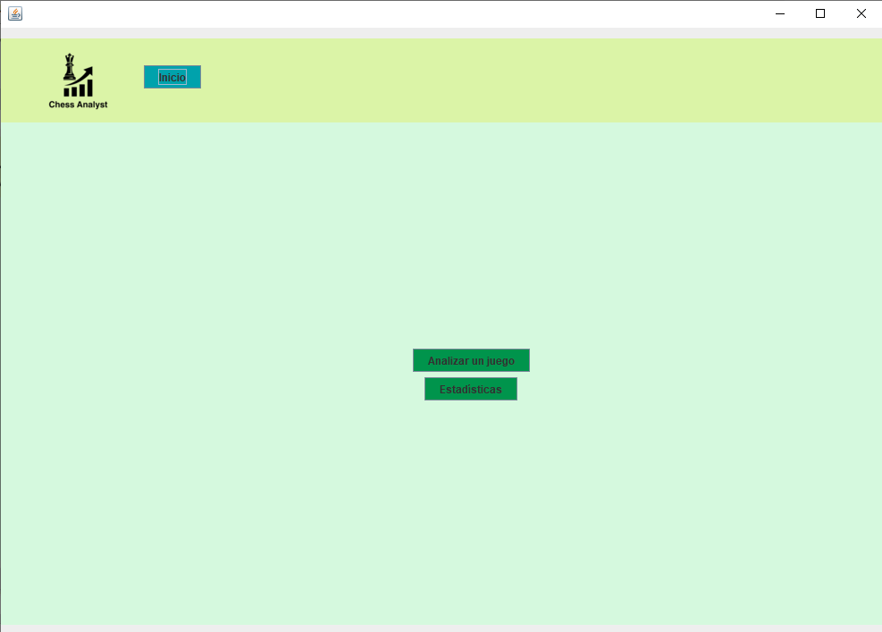
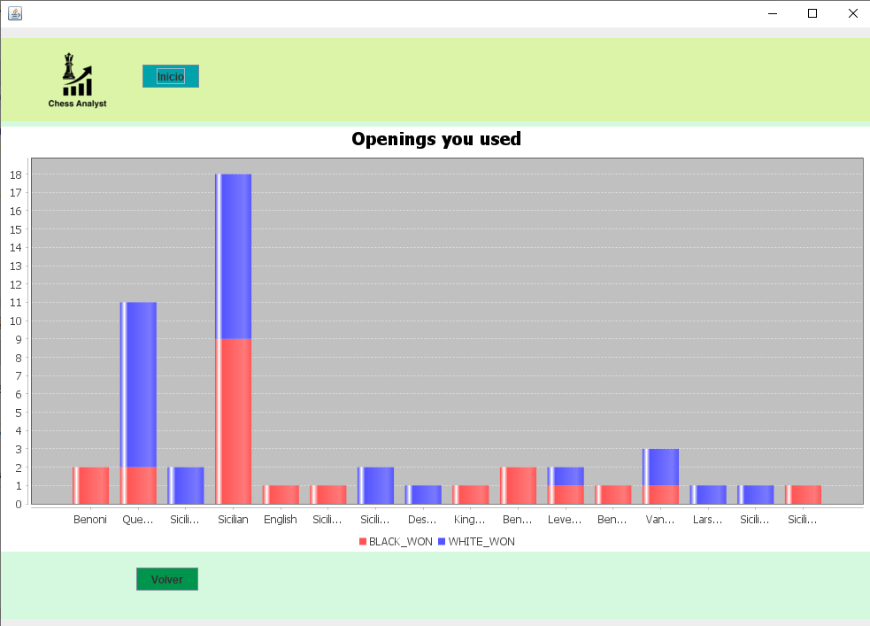
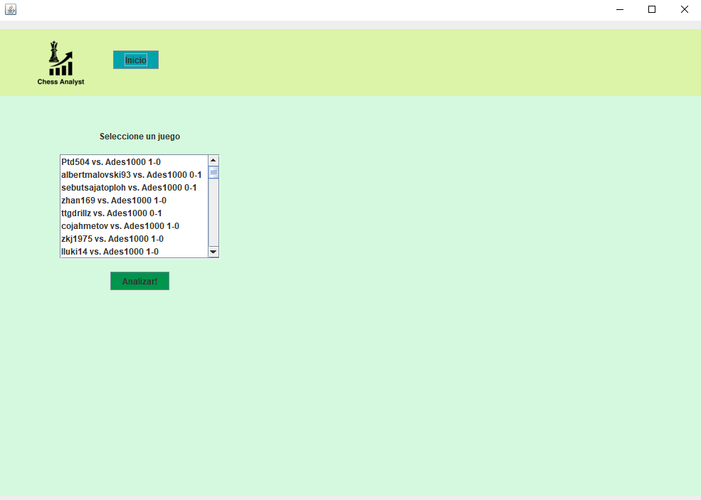
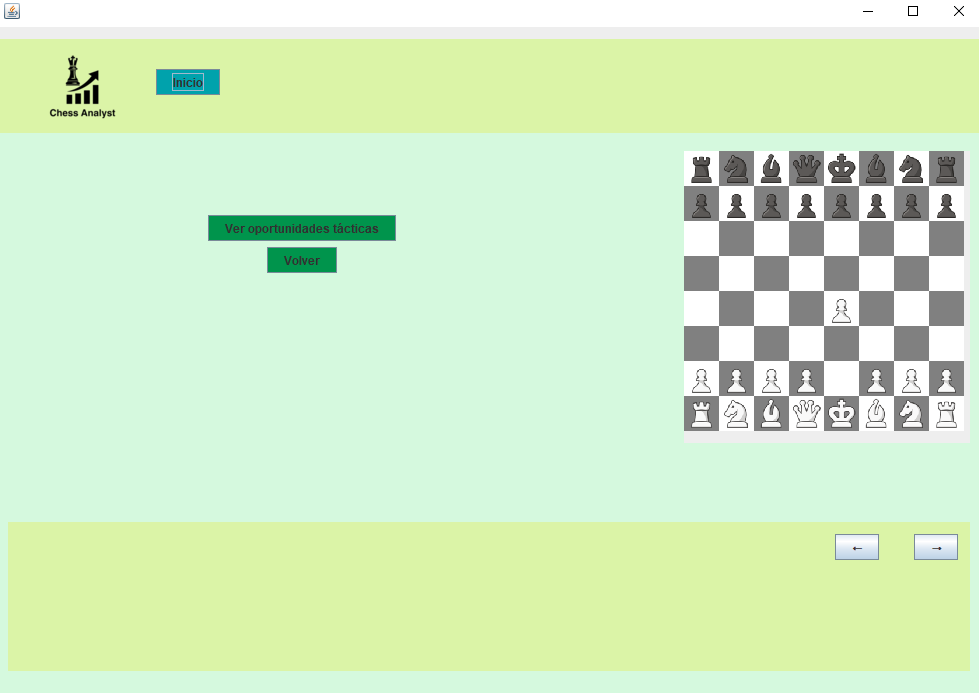

### Oportunidades tácticas y ejercicios
Practica con posiciones tácticas extraídas de tus partidas o con ejercicios predefinidos.

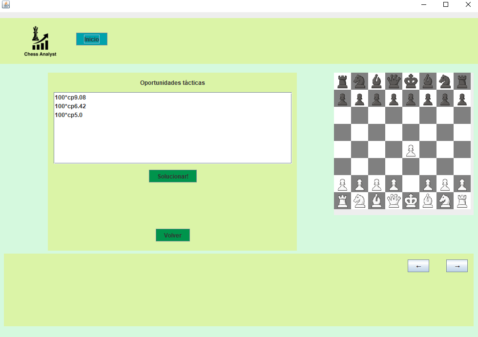
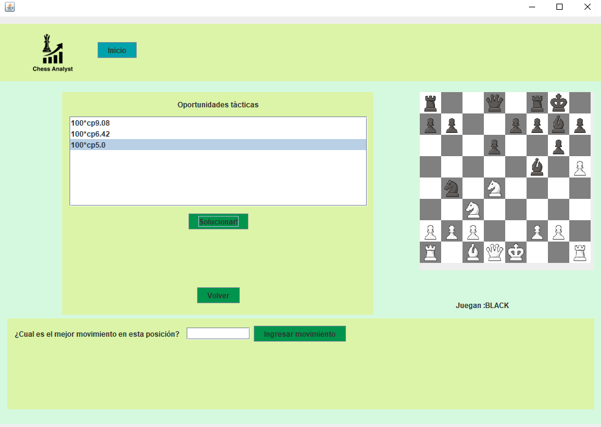
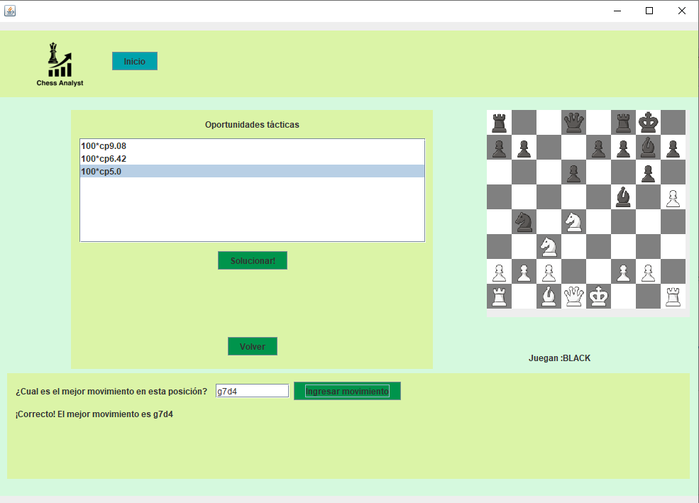
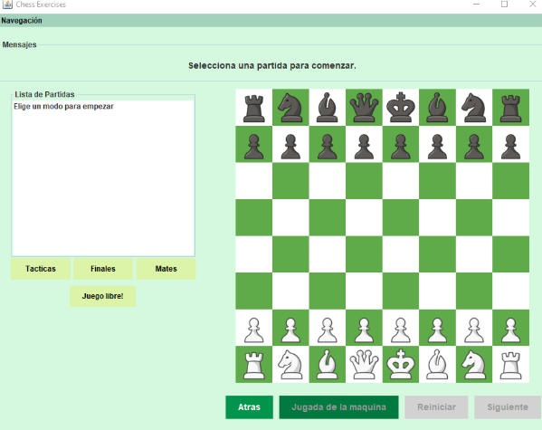
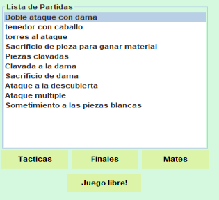
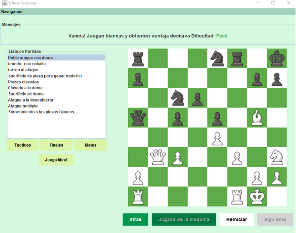
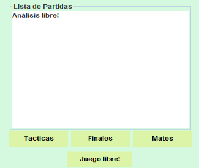
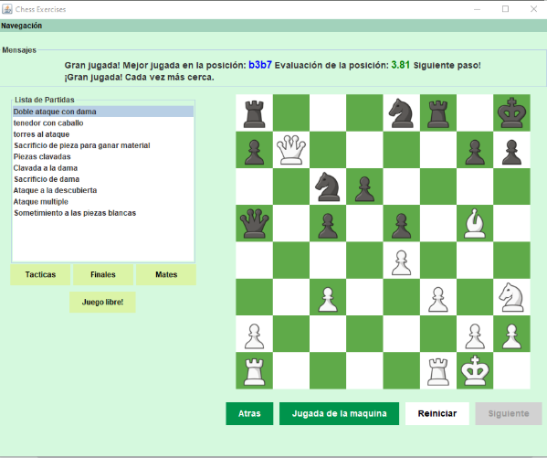

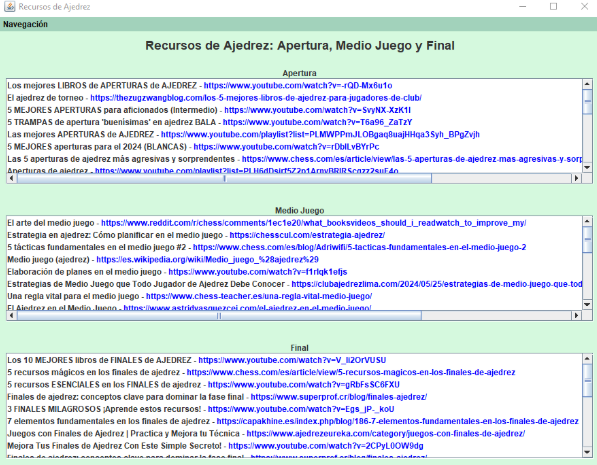

## Créditos y Licencia
- Motor Stockfish incluido bajo GPL v3 (ver `src/resources/stockfish/Copying.txt`)
- Proyecto desarrollado para fines educativos y de análisis personal.

---

**Nota:** Si tienes problemas con rutas, asegúrate de usar rutas relativas desde la raíz del proyecto y de que los archivos requeridos estén presentes en las ubicaciones indicadas.
